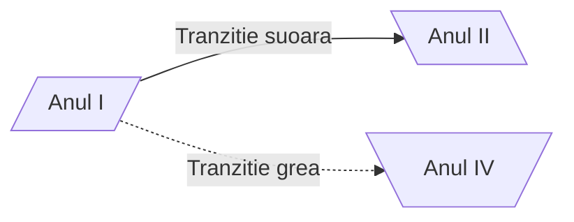

<script id= "MathJax-script" async src="https://cdn.jsdelivr.net/npm/mathjax@3/es5/tex-mml-chtml.js"> </script>


[Homepage](index.md)

# Diagrame de tip _Flowchart_



**De retinut:**
- Diagramele _floecharte_ au _noduri_ si _conectori_
- Nodurile au:
  - **forma** (data de parantezele folosite la descrierea _nodului_)
  - ID (sirul folosit in afara descrierii nodului)
  - Descriere (texul ce apare in caseta nodului si care este implementat in interiorul diferitelor tipuri de paramteze - ce decid forma casetei nodului)
  - Conectorii au:
   - Diferite tipuri de sageti sau chiar pot activa fara sageti
   - Diferite tipuri de linii :
      - `-->` linie continua (sageata dreapta)
      - `--` linie continua (fara sageata)
      - `<-->` linie continua (sageata stanga si sageata dreapta)
      - `==>` linie ingrosata cu sageata spre dreapta
      - 

  ## Diagrama _flowcharte_ avansat

  ```mermaid
A --> B & C & D --> E
  ```
